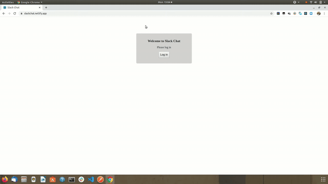

# Slack-clone

A backend for Slack clone (real time chat application) built using the Serverless framework

<!-- TABLE OF CONTENTS -->

## Table of Contents

- [About the Project](#about-the-project)
  - [Built With](#built-with)
- [Getting Started](#getting-started)
  - [Prerequisites](#prerequisites)
  - [Installation](#installation)
- [Usage](#usage)
- [Roadmap](#roadmap)
- [Contributing](#contributing)
- [License](#license)
- [Contact](#contact)
- [Acknowledgements](#acknowledgements)

<!-- ABOUT THE PROJECT -->

## About The Project

This is a capstone project for the Cloud Developer Nanodegree Program. It is a serverless backend that serves a Slack clone chat application.

Features include

- Creating and joining channels
- Send and receive messages in real time
- Edit and delete messages
- Send messages with image attachments
- Authentication: a user must be logged in via Auth0 to access the application

The frontend for this project is accessible at [https://slackchat.netlify.app](https://slackchat.netlify.app/)

UI screenshot:


### Built With

This section should list any major frameworks that you built your project using. Leave any add-ons/plugins for the acknowledgements section. Here are a few examples.

- [Node](https://nodejs.org/en/)
- [TypeScript](https://www.typescriptlang.org/)
- [Serverless Framework](https://www.serverless.com)
- [AWS (S3, API Gateway, Lambda, DynamoDB)](https://aws.amazon.com)
- [Auth0: Authentication](https://auth0.com/)

<!-- GETTING STARTED -->

## Getting Started

This is an example of how you may give instructions on setting up your project locally.
To get a local copy up and running follow these simple example steps.

### Prerequisites

Ensure you have installed the following on your system

- [Node & npm](https://nodejs.org/en/)
- [Serverless](https://www.serverless.com/framework/docs/getting-started/)

Set up your AWS credentials in your local environment. ([Guide](https://docs.aws.amazon.com/cli/latest/userguide/cli-chap-configure.html))

### Installation

1. Clone the repo and switch to newly created directory

```sh
git clone https://github.com/JaymesKat/slack-clone-backend
cd slack-clone-backend
```

2. Install NPM packages

```sh
npm install
```

3. Enter your `AWS_PROFILE` name in a `.env` file in the root of the project

```sh
AWS_PROFILE = 'ENTER YOUR AWS profile name';
```

4. Deploy the application to AWS

```sh
sls deploy
```

<!-- USAGE EXAMPLES -->

## Demo



<!-- LICENSE -->

## License

Distributed under the MIT License. See `LICENSE` for more information.

<!-- CONTACT -->

## Contact

Your Name - [@JaymesKat](https://twitter.com/JaymesKat)

Project Link: [https://github.com/JaymesKat/slack-clone-backend](https://github.com/JaymesKat//slack-clone-backend])

Frontend repo: [https://github.com/JaymesKat/slack-chat-clone-frontend](https://github.com/JaymesKat/slack-chat-clone-frontend])

<!-- ACKNOWLEDGEMENTS -->

## Acknowledgements

- [Best-README-Template](https://github.com/othneildrew/Best-README-Template)
- Inspiration: [Slack clone by Danutz Codrescu](https://github.com/danutzcodrescu/slack-clone)
